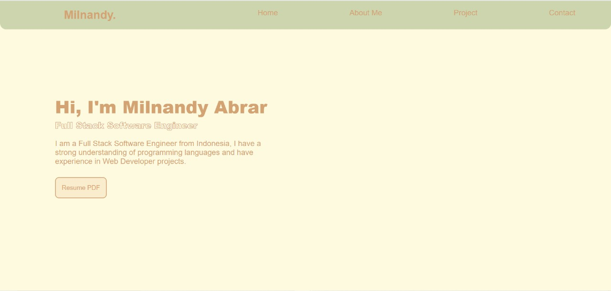
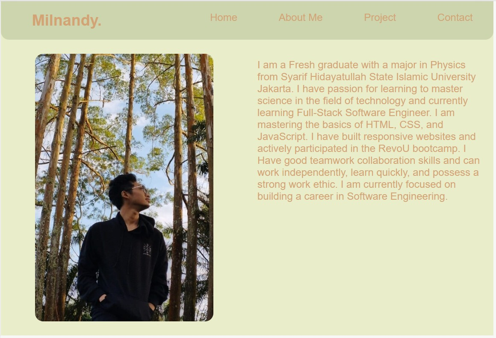

# **Milnandy Personal Portofolio Website**

## Preview Home Page Dekstop

## Preview About Me 768px

## Preview Contact 480px

## Overview

This project is a simple yet elegant personal landing page that serves as an online portfolio. It’s designed to introduce myself, display my featured projects in the future, and provide contact options - all within a single-page smooth scrolling experience. 

## Features

- Responsive layout for desktop, tablet, and mobile
- Fixed navigation bar with smooth scroll
- Hamburger menu containing each section
- Transition logo on navigation bar when on scroll
- Section-based design: Home, About, Projects and Contact
- Email and social media icons (using Boxicons)
- Minimalist, modern aesthetic with custom color palette
- Scroll-friendly layout with clean structure
- Transition ease in out

## Technologies Used

- **HTML5** - semantic elements for structure
- **CSS3** - for layout, animation, and responsiveness
- **SVG Repo** - for consistent icon design
- **Netlify** - for easy deployment and live hosting
- **Github** - for easy deployment and live hosting
- **Tailwind4** - utility-first CSS framework for styling and responsiveness
- **Idwebhost** - for buying domain with cheap discounted price
- **Cloudflare** - for relocate server name with more feature

## Link Page
A clean and responsive personal landing page built with **HTML, CSS, JS, Tailwind4** -- showcasing my profile, projects, and contact info --.  

Live Demo 👉 [Click here](https://vermillion-strudel-d53a5e.netlify.app/)
- https://vermillion-strudel-d53a5e.netlify.app/
- https://milestone.milnandy.my.id/
- https://revou-fsse-jun25.github.io/milestone-1-Milnandy/